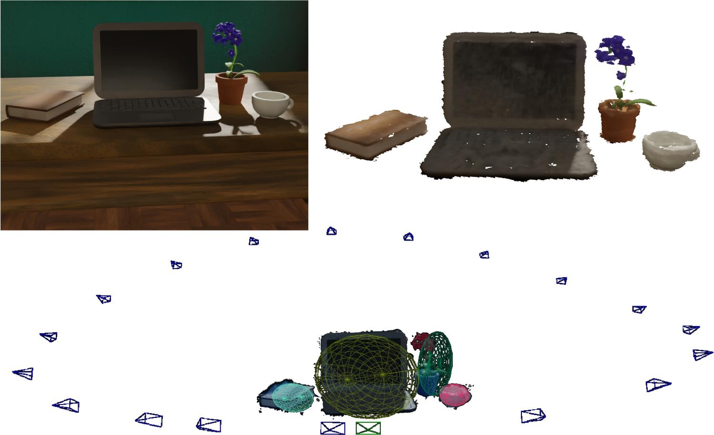



# DQO-MAP: Real-Time Object-Level SLAM via Dual Quadrics and Gaussians

The relevant files have not been uploaded completely yet, and the following operations still cannot be fully implemented.



This repository contains the official implementation of the paper "DQO-MAP: Real-Time Object-Level SLAM via Dual Quadrics and Gaussians", available at [here](https://github.com/LiHaoy-ux/DQO-MAP).

Abstract: *While 3D Gaussian Splatting has recently demonstrated impressive results in scene-level reconstruction, it lacks the ability to reconstruct and track individual objects with accurate poses. This limitation hinders its application in downstream tasks such as augmented reality and embodied AI, where object-level understanding is essential. To address this gap, we propose DQO-MAP, a real-time online multi-object SLAM framework that jointly estimates the 6-DoF poses of objects and reconstructs their shapes using dual quadrics and Gaussians. Our method performs object initialization and association on the CPU and runs parallel optimization on the GPU. With object IDs as guidance, it enables fast and independent reconstruction of multiple objects in a scene. Experimental results on *Cube-Diorama*, *Replica*, and self-collected datasets demonstrate that DQO-MAP achieves higher reconstruction accuracy, completeness, and pose precision while running faster and with lower memory than prior methods. Code and datasets are available at https://github.com/LiHaoy-ux/DQO-MAP.*


## 1. Installation

### 1.1 Clone the Repository

```
git clone --recursive https://github.com/LiHaoy-ux/DQO-MAP
cd DQO-MAP
```

### 1.2 Python Environment
DQO-MAP was validated with Python 3.9, CUDA 11.7, and PyTorch 1.13.1; the most convenient route to install every dependency is via [anaconda](https://www.anaconda.com/) and [pip](https://pypi.org/project/pip/)  and [pip](https://pypi.org/project/pip/)using the following steps:

```bash
conda env create -f environment.yaml
conda activate DQO-MAP
```

### 1.3 Modified ORB-SLAM2 Python Binding
We modified ORB-SLAM2 to integrate with our ICP front-end; simply execute this script to set up pangolin, opencv, orbslam and the boost-python bindings.

```bash
bash build_orb.sh
```
#### ORB-SLAM2 
Real-world sequences require ORB-SLAM2 backend optimization;  install its Python bindings following the provided steps.  We forked [ORB_SLAM2-PythonBindings
](https://github.com/jskinn/ORB_SLAM2-PythonBindings). for compatibility.  Consult the original repo for build issues.  Skip this step if you only test on synthetic datasets like Replica.


### 1.4 Test ORB-SLAM2 Python Binding
```bash
cd thirdParty/pybind/examples
python orbslam_rgbd_tum.py # please set voc_path, association_path ...
python eval_ate.py path_to_groundtruth.txt trajectory.txt --plot PLOT --verbose
```
Once the program completes with no errors and the trajectory matches expectations, proceed to the following stage.
## 2. Dataset Preparation
### 2.1 Replica
```bash
bash scripts/download_replica.sh
```
### 2.2 Room
```bash
bash scripts/download_room.sh
```

### 2.3 Dataset

```
|-- data
    |-- aithor
        |-- aithor1
        |-- aithor2
    |-- real
    	|-- real_world
    |-- Replica
    	|-- room0
    	|-- office0
    |-- Cube_Diorama
    	|-- room
    	
```

## 3. Run


### 3.1 Replica
```bash
# Single Process: Recommended, More Stable
python slam.py --config ./configs/replica/office0.yaml
# Multi Process: 
python slam_mp.py --config ./configs/replica/office0.yaml
```

### 3.2 Room
```bash
# Single Process: Recommended, More Stable
python slam.py --config ./configs/Cube_Diorama/room.yaml
# Multi Process: 
python slam_mp.py --config ./configs/Cube_Diorama/room.yaml
```

### 3.3 Real
```bash
# Single Process: Recommended, More Stable
python slam.py --config ./configs/real/real.yaml
# Multi Process: 
python slam_mp.py --config ./configs/real/real.yaml
```

### 3.4 aithor
```bash
# Single Process: Recommended, More Stable
python slam.py --config ./configs/aithor/aithor1.yaml
# Multi Process: 
python slam_mp.py --config ./configs/aithor/aithor1.yaml
```
### 3.5 Set GUI

If you do not want the GUI runtime window to be displayed, set use_gui: False (default true) in the last line of config/base.yaml.

### 4 News and TODOs


* - [X] 📰The DQO-MAP paper published online
* - [X] 🔥Release the rough version of the source code
* - [ ] The complete source code after open source refactoring
* - [ ] Publish the dataset online
* - [ ] A GUI page for achieving parallel and efficient mesh visualization
* - [ ] Implement an object association strategy with higher speed and accuracy


<section class="section" id="BibTeX">
  <div class="container is-max-desktop content">
    <h2 class="title">BibTeX</h2>
    <pre><code>@article{li2025dqo,
  title={DQO-MAP: Dual Quadrics Multi-Object mapping with Gaussian Splatting},
  author={Li, Haoyuan and Ye, Ziqin and Hao, Yue and Lin, Weiyang and Ye, Chao},
  journal={arXiv preprint arXiv:2503.02223},
  year={2025}
}</code></pre>
  </div>
</section>


## Acknowledgments
This work extends [3DGS](https://github.com/graphdeco-inria/gaussian-splatting), leverages the ORB-SLAM2 backend from [ORB-SLAM2](https://github.com/raulmur/ORB_SLAM2)., and adopts the Python bindings provided by [ORB_SLAM2-PythonBindings](https://github.com/jskinn/ORB_SLAM2-PythonBindings). We also acknowledge the impressive contributions of  [RTG-SLAM](https://github.com/MisEty/RTG-SLAM) and express our gratitude to all the authors for their outstanding efforts.
